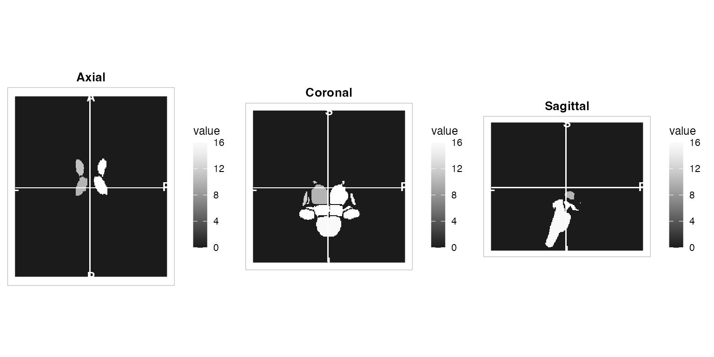
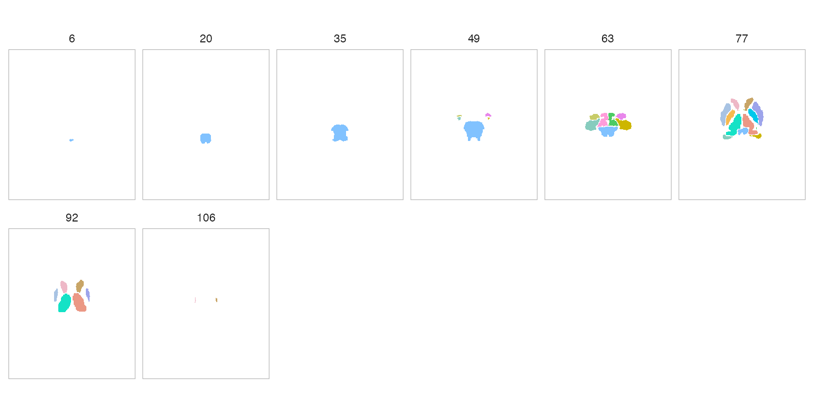
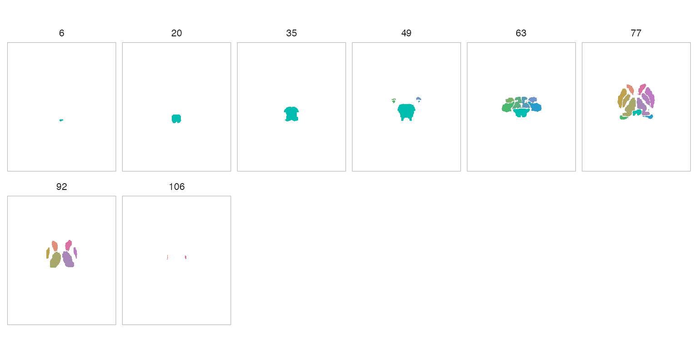
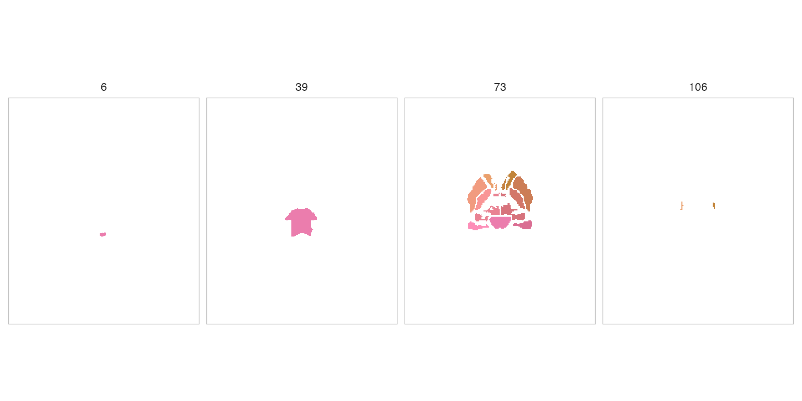

# Atlas Visualization with Optimal Colours

## Introduction

Every atlas in neuroatlas can be visualised with a single call to
[`plot()`](https://rdrr.io/r/graphics/plot.default.html). Behind the
scenes, [`plot.atlas()`](../reference/plot-methods.md) renders coloured
parcels as volumetric slices using **neuroim2**’s `plot_montage()` and
`plot_ortho()`, with colours assigned automatically by the
**roi_colors** system.

``` r
library(neuroatlas)
```

## Quick Start

``` r
atlas <- get_aseg_atlas()
plot(atlas)
```


The default view is a multi-slice **montage** (axial slices) with
colours chosen by the `rule_hcl` algorithm — a fast, deterministic
palette that uses network hues and hemisphere luminance differences.

For a three-plane **orthogonal** view:

``` r
plot(atlas, view = "ortho")
```



## Colour Algorithms

neuroatlas ships four colour algorithms, each suited to different use
cases. Pass the `method` argument to
[`plot()`](https://rdrr.io/r/graphics/plot.default.html) to switch
between them.

### rule_hcl (default)

Deterministic and fast. Assigns hues per network with anterior-posterior
gradients and hemisphere luminance offsets.

``` r
plot(atlas, method = "rule_hcl", nslices = 8)
```


### maximin_view

Optimises perceptual separation between spatially neighbouring ROIs
across slice views. Best for publication figures where adjacent parcels
must be easily distinguished.

``` r
plot(atlas, method = "maximin_view", nslices = 8)
```



### network_harmony

Network-aware: ROIs in the same network share analogous hue families
while still maximising local separation. Requires the atlas to have a
`$network` field (e.g. Schaefer atlases).

``` r
# Requires a Schaefer atlas with network metadata (network download)
schaefer <- get_schaefer_atlas(parcels = "200", networks = "7")
plot(schaefer, method = "network_harmony", nslices = 8)
```

### embedding

Projects ROI features to 2D (PCA or UMAP) and maps polar angle to hue,
yielding globally structured gradients.

``` r
plot(atlas, method = "embedding", nslices = 8)
```



## Custom Colours

You can supply your own colours as a named character vector (names are
region IDs) or as a tibble from
[`atlas_roi_colors()`](../reference/atlas_roi_colors.md).

### Named vector

``` r
my_cols <- setNames(rainbow(length(atlas$ids)), atlas$ids)
plot(atlas, colors = my_cols, nslices = 6)
```


### Pre-computed tibble

``` r
color_tbl <- atlas_roi_colors(atlas, method = "maximin_view")
head(color_tbl)
#> # A tibble: 6 x 2
#>      id color  
#>   <dbl> <chr>  
#> 1    10 #14E2C6
#> 2    11 #EEB8C7
#> 3    12 #A8C3E3
#> 4    13 #F6BA4F
#> 5    16 #81C2FF
#> 6    17 #87CCBE
plot(atlas, colors = color_tbl, nslices = 6)
```


## Programmatic Colour Access

The [`atlas_roi_colors()`](../reference/atlas_roi_colors.md) function is
the bridge between atlas objects and the `roi_colors_*()` family. It
extracts ROI centroids, builds a metadata tibble, and dispatches to the
requested algorithm.

``` r
cols <- atlas_roi_colors(atlas, method = "rule_hcl")
cols
#> # A tibble: 17 x 2
#>       id color  
#>    <dbl> <chr>  
#>  1    10 #FC90AD
#>  2    11 #EAA06D
#>  3    12 #F19B7F
#>  4    13 #F99596
#>  5    16 #EB7DAD
#>  6    17 #FD8EB8
#>  7    18 #F79690
#>  8    26 #ED9E73
#>  9    28 #E98292
#> 10    49 #D97088
#> 11    50 #C28439
#> 12    51 #CC7D56
#> 13    52 #D3776A
#> 14    53 #DA6E93
#> 15    54 #D17963
#> 16    58 #C58241
#> 17    60 #D7737C
```

This tibble can be joined with other atlas metadata for downstream
analyses.

## Controlling Slice Count

Use `nslices` to control how many slices appear in the montage:

``` r
plot(atlas, nslices = 4)
```



## Existing Visualisation Tools

For flatmap-style cortical visualisations (not volumetric), neuroatlas
also provides:

- [`ggseg_schaefer()`](../reference/ggseg_schaefer.md) — ggseg-based
  Schaefer flatmaps
- [`plot_glasser()`](../reference/plot_glasser.md) — Glasser atlas
  flatmaps

These are complementary to
[`plot()`](https://rdrr.io/r/graphics/plot.default.html) and remain
available as standalone functions.
