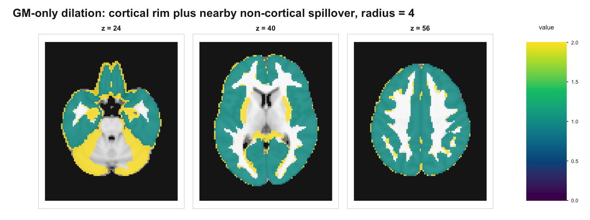
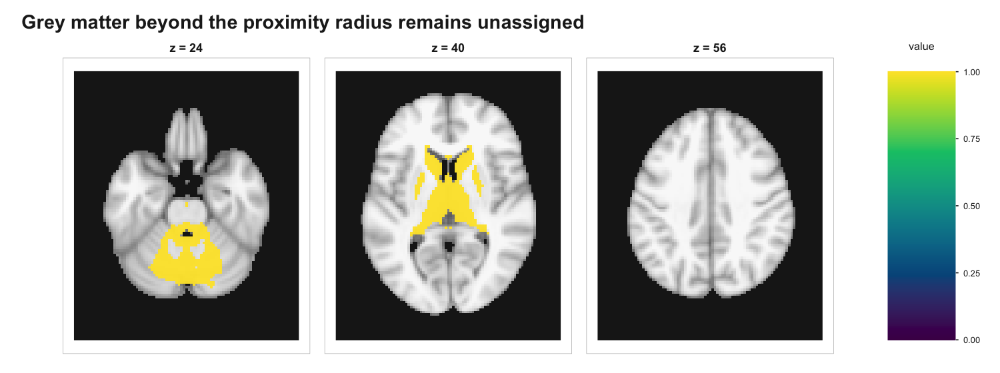

```{r setup, include = FALSE}
if (requireNamespace("ggplot2", quietly = TRUE) && requireNamespace("albersdown", quietly = TRUE)) ggplot2::theme_set(albersdown::theme_albers(family = params$family, preset = params$preset))
knitr::opts_chunk$set(
  collapse = TRUE,
  comment = "#>",
  echo = TRUE,
  eval = FALSE  # heavy + network-dependent; figures are pre-rendered
)

suppressWarnings(suppressMessages(library(neuroatlas)))
```

```{r albers-classes, echo=FALSE, results='asis'}
cat(sprintf(
  paste0(
    '<script>document.addEventListener("DOMContentLoaded",function(){',
    'document.body.classList.remove("palette-red","palette-lapis","palette-ochre","palette-teal","palette-green","palette-violet","preset-homage","preset-study","preset-structural","preset-adobe","preset-midnight");',
    'document.body.classList.add("palette-%s","preset-%s");',
    '});</script>'
  ),
  params$family,
  params$preset
))
```

## Why dilate a parcellation?

A hard parcellation such as Schaefer-400 is defined on one template at one
resolution, and its parcels do not perfectly tile the cortical ribbon. Voxels
slip through the cracks at parcel borders, deep in sulci, and wherever the
parcellation's source data did not quite reach. When you summarise an image
through such an atlas --- say with `reduce_atlas()` --- that uncovered grey
matter is silently dropped: it belongs to no parcel, so it never enters any
regional average.

`dilate_atlas()` closes those gaps by **growing parcels outward into nearby
unassigned voxels**, with two explicit constraints. These constraints are useful
but they are not a substitute for an anatomical cortex mask:

1. **A grey-matter mask.** Parcels may only expand into voxels you mark as
   valid. Supply a mask built from a tissue-probability map and the dilation
   stays inside grey matter instead of bleeding into white matter, CSF, or the
   space outside the brain.
2. **A proximity radius.** A voxel is only claimed if a parcel lies within
   `radius` voxels of it. Grey matter that is too far from any parcel --- for a
   cortical atlas, that means the cerebellum and the depths of the subcortex ---
   is left unassigned rather than absorbed by whatever cortical parcel happens
   to be nearest. Grey matter that is near a cortical parcel can still be
   claimed if your mask allows it.

This vignette walks through the whole pipeline on real data: a Schaefer-400
volume atlas, a TemplateFlow grey-matter probability map, and a T1-weighted
template to plot against.

## The three ingredients

```{r ingredients}
library(neuroatlas)
library(neuroim2)

# 1. The atlas to dilate: Schaefer-400, 7 networks, 2 mm (MNI152NLin6Asym)
sch <- get_schaefer_atlas("400", "7", "2")

# 2. A grey-matter probability map (TemplateFlow tissue probseg)
gm <- get_template(
  space = "MNI152NLin2009cAsym",
  variant = "probseg",
  label = "GM",
  resolution = 2
)

# 3. A T1-weighted template, purely as an anatomical backdrop for figures
t1 <- get_template(
  space = "MNI152NLin6Asym",
  variant = "brain",
  modality = "T1w",
  resolution = 2
)
```

## Getting everything onto one grid

`dilate_atlas()` works voxel-by-voxel, so the mask must sit on exactly the same
grid as the atlas. Two details matter here:

- The Schaefer volume is distributed in **`MNI152NLin6Asym`** space (the FSL
  MNI template).
- TemplateFlow only ships the tissue-class grey-matter probability map in
  **`MNI152NLin2009cAsym`** space.

So the grey-matter map and the atlas start out in different MNI variants. We
bring the map (and the T1) onto the atlas grid with `resample()`. These are
both MNI variants, so an affine reslice aligns them to within a voxel or two ---
good enough for building a grey-matter mask, though for a publication you might
prefer a proper nonlinear transform between the two templates.

```{r resample}
sp    <- neuroim2::space(sch$atlas)   # the atlas grid
gm_rs <- resample(gm, sp)             # GM probability on the atlas grid
t1_rs <- resample(t1, sp)             # T1 on the atlas grid
```

## Building the grey-matter mask

The mask is just the probability map thresholded at the level you consider
"grey matter enough". Following the brief for this vignette we use
`p > 0.33`: a permissive cut that captures the cortical ribbon plus a generous
margin.

```{r mask}
gm_mask <- neuroim2::LogicalNeuroVol(gm_rs > 0.33, space = sp)
```

How much of that grey matter does the raw atlas already cover? Comparing the
mask against the parcel labels shows the size of the problem:

```{r coverage-before}
av  <- as.vector(neuroim2::as.dense(sch$atlas))
gmv <- as.vector(gm_rs) > 0.33

sum(gmv)                 # grey-matter voxels (p > 0.33):        158,085
sum(gmv & av > 0)        # already inside a Schaefer parcel:     111,688  (70.7%)
sum(gmv & av == 0)       # grey matter with no parcel:            46,397  (29.3%)
```

Nearly **30%** of the grey-matter mask falls outside every parcel. Some of that
is the thin shell of ribbon the parcellation just missed; some of it is grey
matter a cortical atlas was never meant to cover (cerebellum, deep nuclei).
The example below shows why those are different problems: a radius can prevent
distant jumps, but only the mask decides what anatomy is eligible.

## Dilating with a permissive grey-matter mask

```{r dilate}
dilated <- dilate_atlas(sch, gm_mask, radius = 4, maxn = 50)
```

`dilate_atlas()` finds every mask voxel that has no label, locates the parcel
voxels within `radius` of it (Euclidean distance, **in voxel units** --- at
2 mm, `radius = 4` reaches 8 mm), and assigns it to a parcel by
inverse-distance-weighted voting over up to `maxn` neighbours. A voxel with no
parcel inside the radius keeps no label. The return value is an ordinary atlas
object --- same class, IDs, and labels as the input --- so it is a drop-in
replacement everywhere the original atlas is used.

At `radius = 4` the parcels grow to cover an extra **23,965** voxels inside the
permissive `p > 0.33` mask, lifting mask coverage from 70.7% to **85.8%**:

```{r coverage-after}
dv <- as.vector(neuroim2::as.dense(dilated$atlas))

sum(dv > 0) - sum(av > 0)   # voxels added by dilation:        23,965
sum(gmv & dv > 0)           # grey matter now covered:        135,653  (85.8%)
sum(gmv & dv == 0)          # grey matter still unassigned:    22,432
```

These counts are coverage of the permissive mask, not proof of cortical-only
coverage. The yellow voxels below are everything dilation added. Some yellow is
the desired cortical-ribbon shell around the original parcels (teal), but the
inferior and middle slices also show the failure mode: nearby subcortical and
cerebellar grey matter can be swept into a cortex-only atlas when it falls
inside the radius.

```{r fig-additions, echo = FALSE, eval = TRUE, out.width = "100%", fig.alt = "Three axial slices showing original Schaefer-400 parcels in teal and all voxels added by radius-four dilation in yellow, including desired cortical rim and nearby non-cortical spillover."}

```

## What the proximity radius leaves out

The 22,432 grey-matter voxels left unassigned are the voxels in the mask with no
parcel inside the radius. In this Schaefer example, they are concentrated in the
deep subcortex and cerebellum because Schaefer is a **cortex-only** atlas. This
figure demonstrates the radius guard against *distant* jumps. It does not imply
that every voxel already assigned by dilation was anatomically cortical.

```{r fig-guard, echo = FALSE, eval = TRUE, out.width = "100%", fig.alt = "Three axial slices highlighting in yellow the grey-matter voxels left unassigned after dilation because they are beyond the radius from any Schaefer parcel."}

```

You can see the trade-off directly by sweeping the radius. A larger radius fills
more of the cortical ribbon, but it can also claim more nearby non-cortical grey
matter when the mask includes it. A smaller radius is more conservative.
Coverage of the `p > 0.33` mask (which starts at 70.7% before dilation):

| `radius` (vox) | reach (mm) | voxels added | grey matter covered | left unassigned |
|:--------------:|:----------:|-------------:|:-------------------:|----------------:|
| 1              | 2          |       13,343 |        79.1%        |          33,054 |
| 2              | 4          |       17,228 |        81.5%        |          29,169 |
| 4 *(default)*  | 8          |       23,965 |        85.8%        |          22,432 |
| 6              | 12         |       30,775 |        90.1%        |          15,622 |

The unassigned remainder stays dominated by distant subcortical and cerebellar
grey matter in this range. The added set, however, can already include nearby
non-cortical voxels by `radius = 4`.

## Choosing a radius (and a mask)

The right `radius` depends on what you want dilation to do:

- **Close small parcellation gaps only.** A tight radius (`1`--`2`) fills the
  thin shell of ribbon between parcels and little else.
- **Maximise grey-matter coverage.** A larger radius (`4`--`6`) recovers more of
  the mask at the cost of pulling in grey matter near the cortical boundary
  that may be subcortical or cerebellar.

The radius is a *proximity* guard, not an *anatomical* one: it cannot tell
cortex from cerebellum, only near from far. If you need a hard anatomical
boundary --- for instance, to guarantee no cerebellar voxel is ever claimed,
regardless of radius --- intersect the grey-matter mask with an anatomical mask
before dilating:

```{r cortex-mask}
# Optional: restrict dilation to a cortical-ribbon mask of your choosing
gm_mask_cortex <- neuroim2::LogicalNeuroVol(
  (gm_rs > 0.33) & (cortex_mask > 0),
  space = sp
)
dilated <- dilate_atlas(sch, gm_mask_cortex, radius = 4)
```

## Using the dilated atlas

Because the result is a regular atlas object, the dilated parcellation flows
straight into the rest of the package. Region summaries computed through it now
draw on the recovered ribbon rather than dropping it:

```{r downstream}
# e.g. summarise a statistical map within the (now more complete) parcels
roi_means <- reduce_atlas(dilated, stat_map, mean)
```

## Reproducing the figures

The figures in this vignette are pre-rendered (the dilation takes a couple of
minutes and the inputs are downloaded from TemplateFlow). The script that builds
them lives at `data-raw/dilation-vignette-figures.R` in the package source and
uses `neuroim2::plot_overlay()` to draw the parcel codes over the resampled T1.

## See also

- `get_schaefer_atlas()` --- the parcellation used here.
- `get_template()` --- TemplateFlow tissue-probability maps and templates.
- `reduce_atlas()` --- summarise data within atlas parcels.
- The *Working with TemplateFlow* vignette for more on spaces and resolutions.
