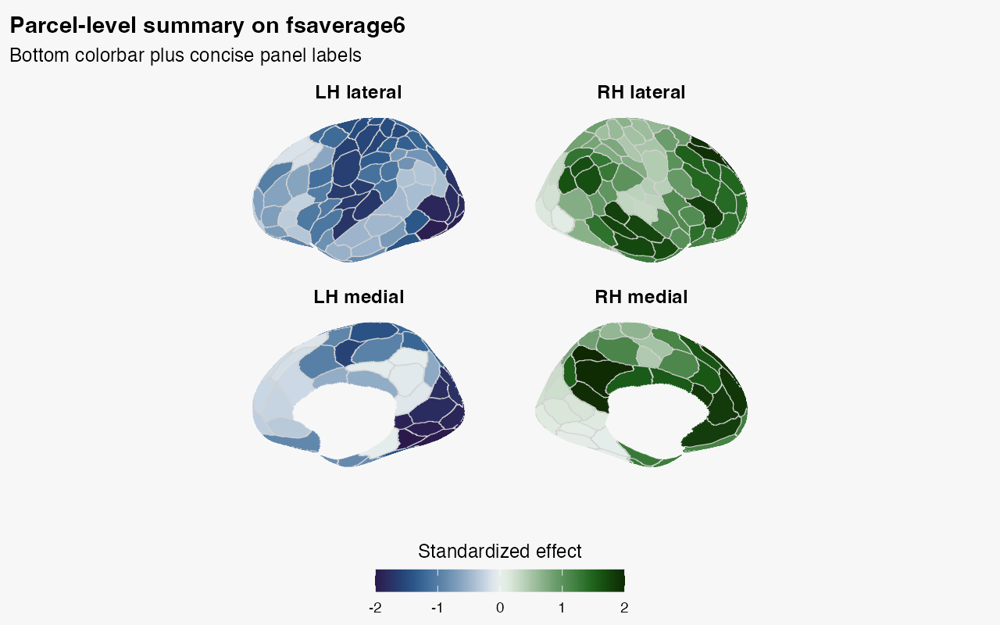

```{r setup, include = FALSE}
if (requireNamespace("ragg", quietly = TRUE)) knitr::opts_chunk$set(dev = "ragg_png")
if (requireNamespace("systemfonts", quietly = TRUE) &&
    requireNamespace("albersdown", quietly = TRUE)) {
  albersdown::albers_register_fonts()
}
if (requireNamespace("ggplot2", quietly = TRUE) && requireNamespace("albersdown", quietly = TRUE)) ggplot2::theme_set(albersdown::theme_albers(family = params$family, preset = params$preset))
can_eval <- requireNamespace("neuroatlas", quietly = TRUE) &&
            requireNamespace("neuroim2", quietly = TRUE) &&
            requireNamespace("ggplot2", quietly = TRUE)
knitr::opts_chunk$set(
  collapse = TRUE,
  comment = "#>",
  fig.width = 8,
  fig.height = 4,
  eval = can_eval
)
```

```{r albers-classes, echo=FALSE, results='asis'}
cat(sprintf(
  paste0(
    '<script>document.addEventListener("DOMContentLoaded",function(){',
    'document.body.classList.remove("palette-red","palette-lapis","palette-ochre","palette-teal","palette-green","palette-violet","preset-homage","preset-interaction","preset-study","preset-structural","preset-adobe","preset-midnight");',
    'document.body.classList.add("palette-%s","preset-%s");',
    '});</script>'
  ),
  params$family,
  params$preset
))
```


Every atlas in neuroatlas can be visualised with a single call to `plot()`.
Behind the scenes, `plot.atlas()` renders coloured parcels as volumetric
slices using **neuroim2**'s `plot_montage()` and `plot_ortho()`, with
colours assigned automatically by the **roi_colors** system.

```{r load}
library(neuroatlas)
```

## Quick Start

```{r quick-montage, fig.alt = "Axial montage of the bundled FreeSurfer ASEG atlas, with subcortical and midline regions shown in distinct colours across twelve slices."}
atlas <- get_aseg_atlas()
plot(atlas)
```

The default view is a multi-slice **montage** (axial slices) with colours
chosen by the `rule_hcl` algorithm --- a fast, deterministic palette that
uses network hues and hemisphere luminance differences.

For a three-plane **orthogonal** view:

```{r quick-ortho, fig.alt = "Orthogonal sagittal, coronal, and axial planes through the bundled ASEG atlas, with each anatomical region in a distinct colour."}
plot(atlas, view = "ortho")
```

### Region legends

By default no legend is drawn --- for a 400-region cortical parcellation it
would be useless. But for small atlases (subcortical, MTL, a handful of ROIs)
a colour legend is genuinely helpful. Pass `legend = TRUE` to add one below a
montage; labels appearing in both hemispheres are disambiguated with
`(L)`/`(R)`:

```{r quick-legend, fig.height = 5, fig.alt = "Axial ASEG montage with a compact region legend below the slices; left and right occurrences of repeated labels are distinguished."}
plot(atlas, legend = TRUE)   # ASEG has 17 regions
```

The legend is capped by `legend_max` (default 30). A request above that limit
emits a warning and omits the legend; raise `legend_max` to override. Legends
are drawn for montage views, not orthogonal views whose planes contain
different subsets of regions.

## Colour Algorithms

neuroatlas ships four colour algorithms, each suited to different use cases.
Pass the `method` argument to `plot()` to switch between them.

### rule_hcl (default)

Deterministic and fast. Assigns hues per network with anterior-posterior
gradients and hemisphere luminance offsets.

```{r rule-hcl, fig.alt = "Eight-slice ASEG montage using deterministic rule-based HCL colours to separate neighbouring anatomical regions."}
plot(atlas, method = "rule_hcl", nslices = 8)
```

### maximin_view

Optimises perceptual separation between spatially neighbouring ROIs across
slice views. Best for publication figures where adjacent parcels must be
easily distinguished.

```{r maximin, fig.alt = "Eight-slice ASEG montage using maximin colours selected to increase separation between spatially adjacent regions."}
plot(atlas, method = "maximin_view", nslices = 8)
```

### network_harmony

Network-aware: ROIs in the same network share analogous hue families while
still maximising local separation. Requires the atlas to have a `$network`
field (e.g. Schaefer atlases).

```{r network-harmony, eval = FALSE}
# Requires a Schaefer atlas with network metadata (network download)
schaefer <- get_schaefer_atlas(parcels = "200", networks = "7")
plot(schaefer, method = "network_harmony", nslices = 8)
```

### embedding

Projects ROI features to 2D (PCA or UMAP) and maps polar angle to hue,
yielding globally structured gradients.

```{r embedding, fig.alt = "Eight-slice ASEG montage using colours derived from a two-dimensional embedding of region features."}
plot(atlas, method = "embedding", nslices = 8)
```

## Custom Colours

You can supply your own colours as a named character vector (names are
region IDs) or as a tibble from `atlas_roi_colors()`.

### Named vector

```{r custom-named, fig.alt = "Six-slice ASEG montage using a caller-supplied rainbow colour for each named region ID."}
my_cols <- setNames(rainbow(length(atlas$ids)), atlas$ids)
plot(atlas, colors = my_cols, nslices = 6)
```

### Pre-computed tibble

```{r custom-tibble, fig.alt = "Six-slice ASEG montage reusing a precomputed table of maximin region colours."}
color_tbl <- atlas_roi_colors(atlas, method = "maximin_view")
head(color_tbl)
plot(atlas, colors = color_tbl, nslices = 6)
```

## Programmatic Colour Access

The `atlas_roi_colors()` function is the bridge between atlas objects and the
`roi_colors_*()` family. It extracts ROI centroids, builds a metadata tibble,
and dispatches to the requested algorithm.

```{r programmatic}
cols <- atlas_roi_colors(atlas, method = "rule_hcl")
cols
```

This tibble can be joined with other atlas metadata for downstream analyses.

## Controlling Slice Count

Use `nslices` to control how many slices appear in the montage:

```{r nslices, fig.alt = "Compact four-slice ASEG montage demonstrating control of the number of displayed axial sections."}
plot(atlas, nslices = 4)
```

## Surface Figures with Layout Control

For cortical surface atlases, `plot_brain()` gives you direct control
over the static figure layout. You can move the colorbar, add figure
titles, and replace the default facet labels without assembling the
figure by hand afterward.

```{r surface-layout-code, eval = FALSE}
surf_atl <- schaefer_surf(
  parcels = 200,
  networks = 7,
  space = "fsaverage6",
  surf = "inflated"
)

surf_vals <- seq(-2, 2, length.out = length(surf_atl$ids))

plot_brain(
  surf_atl,
  vals = surf_vals,
  views = c("lateral", "medial"),
  interactive = FALSE,
  style = "ggseg_like",
  colorbar = "bottom",
  colorbar_title = "Standardized effect",
  title = "Parcel-level summary on fsaverage6",
  subtitle = "Bottom colorbar plus concise panel labels",
  panel_labels = c(
    "Left Lateral" = "LH lateral",
    "Right Lateral" = "RH lateral",
    "Left Medial" = "LH medial",
    "Right Medial" = "RH medial"
  )
)
```

```{r surface-layout, echo = FALSE, out.width = "100%", fig.alt = "Schaefer parcels on left and right inflated hemispheres in lateral and medial views, coloured by one value per parcel with a horizontal effect-size colorbar."}

```

Because this example mixes lateral and medial views, each short label retains
both hemisphere and view. For a dedicated guide to multi-panel layout, shared
legends, and the default hemisphere-orientation convention, see
`vignette("surface-panels", package = "neuroatlas")`.

## Which entry point should you use?

Use `plot()` for volume atlases and `plot_brain()` for surface atlases. The
older ggseg helpers are migration paths: `ggseg_schaefer()` is deprecated and
`plot_glasser()` has been removed with a stop-level deprecation. New code
should load a surface atlas with `schaefer_surf()` or `glasser_surf()` and pass
it to `plot_brain()`.
