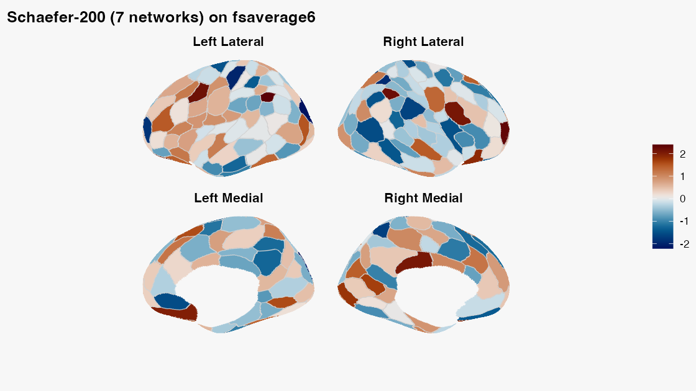
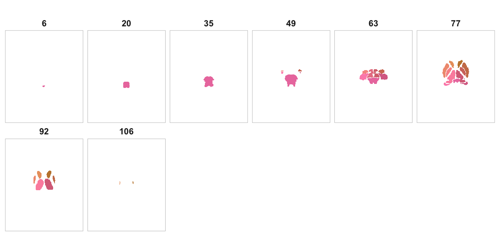

```{r setup, include = FALSE}
if (requireNamespace("ggplot2", quietly = TRUE) && requireNamespace("albersdown", quietly = TRUE)) ggplot2::theme_set(albersdown::theme_albers(family = params$family, preset = params$preset))
knitr::opts_chunk$set(
  collapse = TRUE,
  comment = "#>",
  echo = TRUE,
  eval = FALSE # Set to FALSE to avoid downloads during vignette build
)
library(neuroatlas)
```

```{r albers-classes, echo=FALSE, results='asis'}
cat(sprintf(
  paste0(
    '<script>document.addEventListener("DOMContentLoaded",function(){',
    'document.body.classList.remove("palette-red","palette-lapis","palette-ochre","palette-teal","palette-green","palette-violet","preset-homage","preset-study","preset-structural","preset-adobe","preset-midnight");',
    'document.body.classList.add("palette-%s","preset-%s");',
    '});</script>'
  ),
  params$family,
  params$preset
))
```

## Introduction

The `neuroatlas` package provides a unified interface for working with neuroimaging atlases and parcellations in R. Whether you're conducting ROI-based analyses, visualizing brain data, or integrating different parcellation schemes, `neuroatlas` streamlines these tasks with consistent, user-friendly functions.

Key features include:

- **Multiple Atlas Support**: Access to Schaefer, Glasser, FreeSurfer ASEG, and Olsen MTL atlases
- **Flexible Resampling**: Transform atlases to different spaces and resolutions
- **ROI Analysis**: Extract and analyze specific regions of interest
- **Visualization**: Integration with ggseg for beautiful brain visualizations
- **TemplateFlow Integration**: Access to standardized templates and spaces

## Loading Atlases

### Schaefer Cortical Atlas

The Schaefer atlas provides cortical parcellations organized by functional networks. It's available in multiple resolutions (100-1000 parcels) and network configurations (7 or 17 networks).

```{r schaefer_basic, eval = FALSE}
# Load Schaefer atlas with 200 parcels and 7 networks
atlas_200_7 <- get_schaefer_atlas(parcels = "200", networks = "7")
atlas_200_7
#> ══ Schaefer Atlas ══════════════════════════════════════════════════════════════
#> Name: Schaefer-200-7networks
#> Dimensions: 182 x 218 x 182
#> Regions: 200
#> Networks: 7
#> Hemispheres: left: 100, right: 100
#> Unique networks: 7

# Use convenience functions for common configurations
atlas_400_17 <- sy_400_17()  # 400 parcels, 17 networks
```

The atlas object contains:
- `atlas`: The parcellation volume (ClusteredNeuroVol)
- `labels`: Region names
- `ids`: Numeric region identifiers
- `network`: Network assignment for each region
- `hemi`: Hemisphere designation ("left" or "right")
- `cmap`: Color map for visualization

### Glasser Multi-Modal Parcellation

The Glasser atlas provides 360 cortical areas defined using multi-modal MRI data:

```{r glasser, eval = FALSE}
# Load the Glasser atlas
glasser <- get_glasser_atlas()
glasser
#> ── Glasser Atlas Summary ────────────────────────────────────────
#>
#> ℹ Atlas Type: Glasser Multi-Modal Parcellation
#> ℹ Resolution: MNI Space
#> ℹ Dimensions: 97 x 115 x 97
#>
#> ◉ Region Summary:
#> |- Total Regions:      360
#> |- Left Hemisphere:    180
#> \- Right Hemisphere:   180

# Check the number of regions
length(glasser$labels)  # 360 regions
#> [1] 360
table(glasser$hemi)     # 180 per hemisphere
#>
#>  left right
#>   180   180
```

### FreeSurfer ASEG Subcortical Atlas

For subcortical structures, use the ASEG (Automatic Segmentation) atlas:

```{r aseg, eval = FALSE}
# Load ASEG subcortical atlas
aseg <- get_aseg_atlas()
aseg
#> ── Atlas Summary ───────────────────────────────────────────
#>
#> ❯ Name:   ASEG
#> ❯ Model:  FreeSurferASEG [volume]
#> ❯ Space:  MNI152NLin6Asym
#> ❯ Dimensions: 193 x 229 x 193
#> ❯ Regions: 17

# View available subcortical structures
head(aseg$labels)
#> [1] "Thalamus"   "Caudate"    "Putamen"    "Pallidum"   "Brainstem"
#> [6] "Hippocampus"
```

### Olsen Medial Temporal Lobe Atlas

For detailed MTL parcellations:

```{r olsen, eval = FALSE}
# Load Olsen MTL atlas
mtl <- get_olsen_mtl()
mtl
#> ── Atlas Summary ───────────────────────────────────────────
#>
#> ❯ Name:   Olsen_MTL
#> ❯ Model:  OlsenMTL [volume]
#> ❯ Space:  MNI152_custom
#> ❯ Dimensions: 182 x 218 x 182
#> ❯ Regions: 16

# Get hippocampus-specific parcellation with anterior-posterior divisions
hipp <- get_hipp_atlas(apsections = 3)  # Divide into 3 A-P sections
```

## Resampling Atlases to Different Spaces

Often you need atlases in a specific space or resolution. The `resample` function handles this:

```{r resampling}
# Define a target space (e.g., 2mm isotropic)
target_space <- neuroim2::NeuroSpace(
  dim = c(91, 109, 91),
  spacing = c(2, 2, 2),
  origin = c(-90, -126, -72)
)

# Resample atlas to target space
atlas_2mm <- resample(atlas_200_7$atlas, target_space)

# Or specify the space when loading
atlas_in_space <- get_schaefer_atlas(
  parcels = "200", 
  networks = "7",
  outspace = target_space
)
```

You can also use TemplateFlow space identifiers:

```{r templateflow_space}
# Resample to MNI152NLin2009cAsym space at 2mm
atlas_mni <- get_schaefer_atlas(
  parcels = "200",
  networks = "7", 
  outspace = "MNI152NLin2009cAsym",  # TemplateFlow space ID
  resolution = "2"
)
```

## Working with Regions of Interest

### Extracting Specific ROIs

Extract individual regions by label or ID:

```{r extract_roi}
# Extract hippocampus from ASEG atlas
hippocampus <- get_roi(aseg, label = "Hippocampus")

# Extract by numeric ID
thalamus <- get_roi(aseg, id = 1)

# Extract multiple regions
subcortical <- get_roi(aseg, label = c("Hippocampus", "Amygdala", "Thalamus"))
```

### Reducing Data by Atlas Regions

Use `reduce_atlas` to summarize neuroimaging data within atlas regions:

```{r reduce_atlas}
# Create example brain data
brain_data <- neuroim2::NeuroVol(
  rnorm(prod(dim(atlas_200_7$atlas))), 
  space = neuroim2::space(atlas_200_7$atlas)
)

# Calculate mean values within each region
region_means <- reduce_atlas(atlas_200_7, brain_data, mean)
head(region_means)
#> # A tibble: 6 × 2
#>   region      value
#>   <chr>       <dbl>
#> 1 LH_Vis_1 -0.00183
#> 2 LH_Vis_2 -0.00873
#> 3 LH_Vis_3  0.0141
#> 4 LH_Vis_4 -0.0129
#> 5 LH_Vis_5 -0.0278
#> 6 LH_Vis_6 -0.0443

# Calculate other statistics
region_sds <- reduce_atlas(atlas_200_7, brain_data, sd, na.rm = TRUE)
region_max <- reduce_atlas(atlas_200_7, brain_data, max)

# Custom function
region_robust_mean <- reduce_atlas(
  atlas_200_7, 
  brain_data, 
  function(x) mean(x, trim = 0.1)
)
```

### Mapping Values to Atlas Regions

Map statistical values back onto atlas regions for visualization:

```{r map_atlas}
# Simulate some statistical values for each region
n_regions <- length(atlas_200_7$labels)
t_values <- rnorm(n_regions, mean = 0, sd = 2)

# Map values to atlas (threshold at ±1.96)
atlas_mapped <- map_atlas(
  atlas_200_7, 
  vals = t_values, 
  thresh = c(1.96, Inf)  # Only show |t| > 1.96
)

# For Glasser atlas
glasser_vals <- rnorm(360)
glasser_mapped <- map_atlas(glasser, glasser_vals, thresh = c(2, 5))
```

## Visualization

`neuroatlas` renders **surface** parcellations with `plot_brain()` and
**volume** atlases with `plot()`. (The older `ggseg_schaefer()` and
`plot_glasser()` helpers are deprecated in favour of `plot_brain()`.)

### Surface parcellations

Map one value per parcel onto a surface atlas. `plot_brain(interactive = TRUE)`
returns a hover-tooltip widget; `interactive = FALSE` returns a static ggplot.

```{r viz_surface_code, eval = FALSE}
sa <- schaefer_surf(parcels = 200, networks = 7, space = "fsaverage6")
plot_brain(
  sa,
  vals     = rnorm(length(sa$ids)),  # one value per parcel
  palette  = "vik",
  colorbar = "bottom"
)
```

```{r viz_surface_fig, echo = FALSE, eval = TRUE, out.width = "100%", fig.alt = "Schaefer-200 (7-network) parcellation on the fsaverage6 surface, lateral and medial views, parcels coloured by a per-parcel value with a diverging palette and a bottom colorbar."}

```

### Volume atlases

`plot()` draws a volume atlas as a multi-slice montage (or three orthogonal
planes with `view = "ortho"`), colouring each region automatically.

```{r viz_volume_code, eval = FALSE}
aseg <- get_aseg_atlas()
plot(aseg, nslices = 8)      # axial montage
plot(aseg, view = "ortho")   # three orthogonal planes
```

```{r viz_volume_fig, echo = FALSE, eval = TRUE, out.width = "100%", fig.alt = "Axial montage of the FreeSurfer ASEG subcortical atlas with each structure in a distinct colour."}

```

See the *Atlas Visualization* and *Surface Parcellations* articles for colour
algorithms, panel layouts, and statistical overlays.

## Combining and Dilating Atlases

### Merging Multiple Atlases

Combine atlases for comprehensive coverage:

```{r merge_atlases}
# Combine cortical and subcortical atlases
cortical <- get_schaefer_atlas(parcels = "100", networks = "7")
subcortical <- get_aseg_atlas()

# Ensure same space
subcortical_resampled <- get_aseg_atlas(outspace = neuroim2::space(cortical$atlas))

# Merge atlases
combined <- merge_atlases(cortical, subcortical_resampled)
combined
#> ── Atlas Summary ───────────────────────────────────────────
#>
#> ❯ Name:   Schaefer-100-7networks::ASEG
#> ❯ Dimensions: 182 x 218 x 182
#> ❯ Regions: 117
#>
#> Structure Distribution:
#> |- Left hemisphere:     57
#> |- Right hemisphere:    58
#> \- Bilateral/Midline:   2
```

### Dilating Atlas Parcels

Fill gaps between parcels using dilation:

```{r dilate_atlas}
# Dilate parcels to fill gaps
dilated <- dilate_atlas(
  atlas = cortical,
  mask = "MNI152NLin2009cAsym",  # Use standard brain mask
  radius = 2,                      # Dilation radius in voxels
  maxn = 20                        # Max neighbors to consider
)

# Use custom mask
brain_mask <- get_template(
  space = "MNI152NLin2009cAsym",
  variant = "mask",
  resolution = "1"
)
dilated_custom <- dilate_atlas(cortical, mask = brain_mask, radius = 3)
```

Note: When fetching masks from TemplateFlow, `variant = "mask"` resolves the correct
combination of `desc` and `suffix` (typically `desc = "brain"`, `suffix = "mask"`),
so you do not need to set `desc` explicitly.

## Surface-Based Atlases

Work with surface-based versions of atlases using neurosurf `NeuroSurface`
objects:

```{r surface_atlas}
# Get Schaefer atlas on fsaverage6 surface (mesh + labels)
surf_atlas <- schaefer_surf(
  parcels  = 400,
  networks = 17,
  space    = "fsaverage6",
  surf     = "inflated"  # "inflated", "white", or "pial"
)

# Access hemisphere meshes with vertex-wise labels
lh_surface <- surf_atlas$lh_atlas
rh_surface <- surf_atlas$rh_atlas

# Surface atlases integrate with the neurosurf package
# for downstream surface-based analyses and visualization
```

You can obtain a similar mesh-plus-label structure for the Glasser MMP1.0
parcellation projected to fsaverage:

```{r glasser_surface_atlas, eval=FALSE}
glasser_surf_atlas <- glasser_surf(
  space = "fsaverage",
  surf  = "pial"
)

lh_glasser <- glasser_surf_atlas$lh_atlas
rh_glasser <- glasser_surf_atlas$rh_atlas
```

## Common Workflows

### ROI-Based Analysis Pipeline

```{r roi_pipeline}
# 1. Load atlas
atlas <- get_schaefer_atlas(parcels = "200", networks = "7")

# 2. Load your brain data
# brain_data <- neuroim2::read_vol("my_statistical_map.nii.gz")

# 3. Extract values by region
roi_values <- reduce_atlas(atlas, brain_data, mean)

# 4. Statistical analysis
# Identify significant regions
sig_regions <- roi_values$value[abs(roi_values$value) > 2]

# 5. Visualize results on the matching surface parcellation
viz_vals <- rep(0, length(atlas$labels))
viz_vals[abs(roi_values$value) > 2] <- roi_values$value[abs(roi_values$value) > 2]
plot_brain(schaefer_surf(parcels = 200, networks = 7), vals = viz_vals)
```

### Multi-Atlas Comparison

```{r multi_atlas}
# Compare parcellations at different resolutions
atlas_100 <- sy_100_7()
atlas_200 <- sy_200_7() 
atlas_400 <- sy_400_7()

# Extract same data with different parcellations
values_100 <- reduce_atlas(atlas_100, brain_data, mean)
values_200 <- reduce_atlas(atlas_200, brain_data, mean)
values_400 <- reduce_atlas(atlas_400, brain_data, mean)

# Compare results across resolutions
# Higher resolution captures more spatial detail
```

### Network-Based Analysis

```{r network_analysis}
# Analyze by functional network
atlas <- get_schaefer_atlas(parcels = "200", networks = "17")

# Extract values
roi_values <- reduce_atlas(atlas, brain_data, mean)

# Add network information
roi_values$network <- atlas$network[match(roi_values$region_id, atlas$ids)]

# Summarize by network
library(dplyr)
network_summary <- roi_values %>%
  group_by(network) %>%
  summarise(
    mean_value = mean(value),
    sd_value = sd(value),
    n_regions = n()
  )

network_summary
```

## Tips and Best Practices

1. **Space Consistency**: Always ensure your atlas and data are in the same space before analysis
2. **Resolution Choice**: Higher parcellation counts provide more spatial detail but may reduce statistical power
3. **Visualization**: Use `interactive = TRUE` for exploratory analysis, `FALSE` for publication figures
4. **Caching**: Atlas files are cached locally after first download to speed up subsequent use
5. **Memory**: Large atlases at high resolution can be memory-intensive; consider downsampling if needed

## Summary

The `neuroatlas` package provides a comprehensive toolkit for neuroimaging atlas work:

- **Unified Interface**: Consistent functions across different atlases
- **Flexible Options**: Multiple parcellation schemes and resolutions
- **Integration**: Works seamlessly with neuroim2, ggseg, and TemplateFlow
- **Visualization**: Both 2D and 3D options for different atlases
- **Analysis Ready**: Built-in functions for ROI extraction and data reduction

For more advanced usage, see the TemplateFlow integration vignette and the package documentation.
