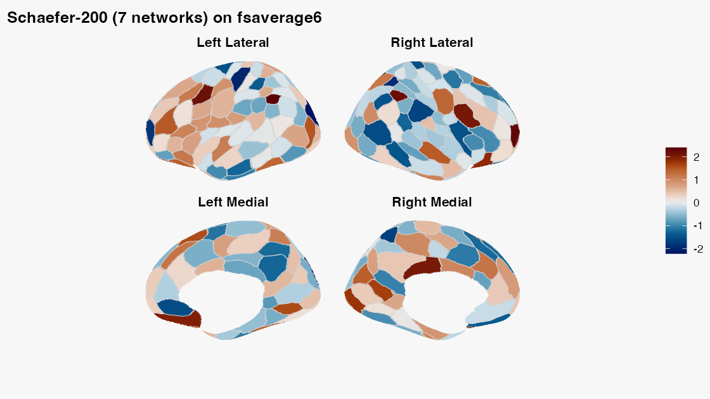

```{r setup, include = FALSE}
if (requireNamespace("ragg", quietly = TRUE)) {
  knitr::opts_chunk$set(dev = "ragg_png")
}
if (requireNamespace("systemfonts", quietly = TRUE) &&
    requireNamespace("albersdown", quietly = TRUE)) {
  albersdown::albers_register_fonts()
}
if (requireNamespace("ggplot2", quietly = TRUE) &&
    requireNamespace("albersdown", quietly = TRUE)) {
  ggplot2::theme_set(
    albersdown::theme_albers(
      family = params$family,
      preset = params$preset
    )
  )
}
knitr::opts_chunk$set(
  collapse = TRUE,
  comment = "#>",
  message = FALSE,
  warning = FALSE,
  fig.width = 8,
  fig.height = 5
)
```

```{r albers-classes, echo=FALSE, results='asis'}
cat(sprintf(
  paste0(
    '<script>document.addEventListener("DOMContentLoaded",function(){',
    'document.body.classList.remove("palette-red","palette-lapis","palette-ochre","palette-teal","palette-green","palette-violet","preset-homage","preset-interaction","preset-study","preset-structural","preset-adobe","preset-midnight");',
    'document.body.classList.add("palette-%s","preset-%s");',
    '});</script>'
  ),
  params$family,
  params$preset
))
```


A surface parcellation answers a simple-looking question: *which cortical
parcel owns each mesh vertex?* The answer involves three aligned pieces:
surface geometry, one integer label per vertex, and region metadata. This
article shows how `neuroatlas` keeps those pieces together and how to attach
one statistic per parcel without changing the atlas.

The first surface-atlas call may download annotation files. For that reason,
network-backed chunks are displayed but not run during package builds. Their
outputs are real committed figures, generated from the code shown here.

## What is a surface atlas?

`schaefer_surf()` returns a `surfatlas`. Its two labelled surfaces share one
region catalogue:

| Object | Contents | Cardinality |
|---|---|---|
| `atl$lh_atlas` | left geometry plus an integer label at every vertex | vertices |
| `atl$rh_atlas` | right geometry plus an integer label at every vertex | vertices |
| `atl$ids`, `atl$labels`, `atl$hemi` | region identity and metadata | parcels |

Load a 200-parcel Schaefer atlas on the bundled `fsaverage6` geometry like
this:

```{r load-schaefer, eval = FALSE}
library(neuroatlas)

atl <- schaefer_surf(
  parcels = 200,
  networks = 7,
  space = "fsaverage6",
  surf = "inflated"
)

class(atl)
class(atl$lh_atlas)
```

The mesh geometry is bundled, while the Schaefer annotation is downloaded and
cached on first use. Annotations supply the vertex labels; geometry alone is
not a parcellation.

## How do you verify geometry and labels?

A grey silhouette proves only that a mesh can be projected. A useful
diagnostic checks topology, label length, and region coverage together:

```{r validate-schaefer, eval = FALSE}
lh_geometry <- neurosurf::geometry(atl$lh_atlas)
lh_labels <- as.integer(atl$lh_atlas@data)

diagnostic <- c(
  vertices = nrow(neurosurf::vertices(lh_geometry)),
  faces = ncol(lh_geometry@mesh$it),
  vertex_labels = length(lh_labels),
  labelled_regions = length(unique(lh_labels[lh_labels > 0]))
)
diagnostic

stopifnot(
  diagnostic[["vertices"]] == diagnostic[["vertex_labels"]],
  diagnostic[["faces"]] > 0,
  diagnostic[["labelled_regions"]] == sum(atl$hemi == "left"),
  all(unique(lh_labels[lh_labels > 0]) %in% atl$ids)
)
```

The resulting parcellation should look like this, with visible parcel
boundaries and more than one label colour:

```{r schaefer-figure-code, eval = FALSE}
plot_brain(
  atl,
  vals = seq(-2.5, 2.5, length.out = length(atl$ids)),
  views = c("lateral", "medial"),
  interactive = FALSE,
  style = "ggseg_like",
  colorbar = "right",
  colorbar_title = "Example value",
  title = "Schaefer-200 (7 networks) on fsaverage6"
)
```

```{r schaefer-figure, echo = FALSE, out.width = "100%", fig.alt = "Schaefer 200-parcel atlas on left and right inflated fsaverage6 surfaces in lateral and medial views. Parcels have distinct blue-to-orange values, visible white boundaries, and a vertical example-value colorbar."}

```

## How do you attach one value per parcel?

Keep the atlas and the results table conceptually separate. The safest workflow
joins a stable result key to atlas metadata; it does not assume the rows already
have atlas order. Here `roi_index` is deliberately reversed:

```{r parcel-values, eval = FALSE}
parcel_results <- tibble::tibble(
  roi_index = rev(atl$ids),
  estimate = rev(seq(-2, 2, length.out = length(atl$ids)))
)

plot_brain(
  atl,
  data = parcel_results,
  value = estimate,
  by = c(id = "roi_index"),
  views = c("lateral", "medial"),
  interactive = FALSE,
  style = "ggseg_like",
  colorbar = "bottom",
  colorbar_title = "Standardized effect"
)
```

`by = c(id = "roi_index")` means “match atlas `id` to result
`roi_index`.” If both tables use `id`, either write `by = "id"` or omit `by`;
the function safely infers it. Full atlas names in `label_full` are another
valid key. Short `label` values can repeat across hemispheres or networks in
Schaefer atlases, so use a unique composite such as
`by = c("label", "hemi", "network")` when full names or IDs are unavailable.

| Result-table key | `by` | Assessment |
|---|---|---|
| `id` | omit, or `"id"` | Preferred: compact, stable, and unique |
| `roi_index` | `c(id = "roi_index")` | Preferred when the ID column was renamed |
| `label_full` | omit, or `"label_full"` | Safe when the full atlas labels are preserved exactly |
| `label`, `hemi`, `network` | `c("label", "hemi", "network")` | Valid only when the combination is unique |
| `label` alone | `"label"` | Usually unsafe for bilateral Schaefer atlases |

Alignment is strict by default. Duplicate result keys, unknown parcels, and
missing atlas parcels are errors. Use `allow_partial = TRUE` only when absent
parcels are intentional; they are then shown as `NA`. You can inspect or reuse
the exact vector sent to the renderer:

```{r align-values, eval = FALSE}
parcel_values <- align_parcel_values(
  atl,
  parcel_results,
  value = estimate,
  by = c(id = "roi_index")
)

stopifnot(
  identical(names(parcel_values), as.character(atl$ids)),
  identical(unname(parcel_values), seq(-2, 2, length.out = length(atl$ids)))
)
```

Passing `vals = parcel_values` remains useful for code that already maintains
atlas order, but a keyed table is safer at analysis boundaries.

`map_atlas()` is the tabular companion to this plot. It does **not** mutate the
surface or return a labelled mesh:

```{r map-values, eval = FALSE}
mapped <- map_atlas(atl, unname(parcel_values))
mapped

stopifnot(
  nrow(mapped) == length(atl$ids),
  identical(mapped$statistic, unname(parcel_values)),
  identical(mapped$region, atl$labels),
  identical(mapped$hemi, atl$hemi)
)
```

Use the tibble for modelling and reporting; pass it directly to `plot_brain()`
for a surface figure.

## How do you extract one surface ROI?

`get_roi()` selects vertices for one or more named regions and returns
`neurosurf::ROISurface` objects. Labels may occur in both hemispheres, so make
the side explicit when the question is unilateral:

```{r surface-roi, eval = FALSE}
region_name <- atl$labels[atl$hemi == "left"][1]
roi <- get_roi(atl, label = region_name, hemi = "left")

stopifnot(
  length(roi) == 1L,
  methods::is(roi[[1]], "ROISurface"),
  length(roi[[1]]) > 0L
)
```

Atlas-level subsetting is currently volume-only. `filter_atlas(atl, ...)` and
`sub_atlas(atl, ...)` fail clearly for a surface atlas; use `get_roi()` for
surface regions rather than expecting a smaller `surfatlas`.

## How do you use per-vertex data?

Parcel values and vertex values are different data shapes. For an already
surface-aligned continuous field, supply one vector per hemisphere through
`overlay`:

```{r vertex-overlay, eval = FALSE}
vertex_values <- list(
  lh = rep(0, nrow(neurosurf::vertices(
    neurosurf::geometry(atl$lh_atlas)
  ))),
  rh = rep(0, nrow(neurosurf::vertices(
    neurosurf::geometry(atl$rh_atlas)
  )))
)

plot_brain(
  atl,
  overlay = vertex_values,
  interactive = FALSE,
  style = "stat_publication",
  colorbar = "bottom",
  overlay_title = "Vertex statistic"
)
```

A `NeuroVol` is not automatically aligned merely because it can be sampled.
The current `plot_brain()` volume projection cannot infer template identity
from a raw `NeuroVol`, check compatibility, or consume a transformed white/pial
pair. Passing a volume is therefore unchecked caller responsibility and is
appropriate only when the volume already uses the resolved surface coordinates.
`fsaverage`, `fsaverage5`, and `fsaverage6` use MNI305 coordinates, whereas
most modern MNI volumes use MNI152 coordinates; do not project the latter
directly. `transform_vertices_to_volume()` is useful for coordinate-level
calculations, but it does not by itself create a `plot_brain()` projection
geometry. A grid reslice does not establish correspondence.

## What about other atlases and templates?

`glasser_surf()` has the same `surfatlas` contract, but uses 164k
`fsaverage` geometry and downloads both geometry and annotations on first use.
Raw geometry from `load_surface_template()` has no atlas labels; the next
article explains that distinction in detail.

Continue with:

1. `vignette("surface-panels")` for shared legends and multi-map figures.
2. `vignette("surface-templates")` for paths, geometry, and per-vertex data.
3. `vignette("working-with-templateflow")` for live asset discovery.
