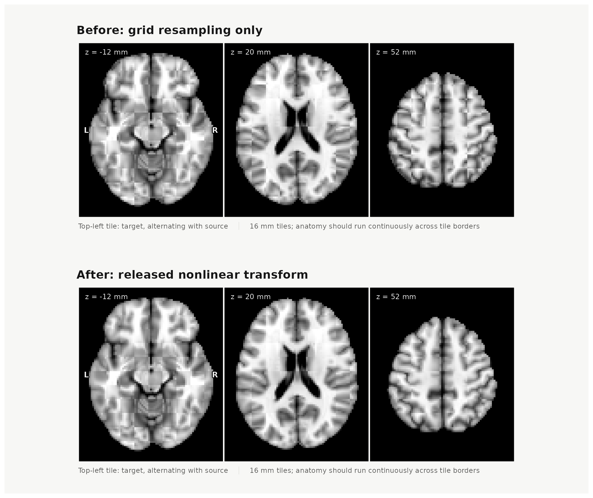

```{r setup, include=FALSE}
knitr::opts_chunk$set(collapse = TRUE, comment = "#>", message = FALSE,
                      warning = FALSE)
```

A template transform moves samples between explicitly named image grids. It
does not estimate a registration, infer an atlas correspondence, or change a
parcellation's region identities. `neuroatlas` resolves an available route and
samples the source once on the target grid.

The application API requires the optional `neurotransform` and `hdf5r` packages.
Install the engine revision pinned in neuroatlas's `Remotes` field; the runtime
checks its H5 conventions against independent fixtures.

## Transform a volume on an explicit target grid

Use `get_template_transform()` followed by `apply_template_transform()`.
The built-in MNI305-to-MNI152 affine route is available without a download.
This offline example supplies continuous semantics and both image grids.

```{r affine-workflow}
library(neuroatlas)
if (!requireNamespace("neurotransform", quietly = TRUE)) {
  stop("This vignette requires the optional neurotransform package.")
}

source_grid <- neuroim2::NeuroSpace(
  c(5L, 5L, 5L), spacing = c(2, 2, 2), origin = c(-4, -4, -4)
)
source <- neuroim2::NeuroVol(array(seq_len(125), c(5, 5, 5)), source_grid)
target_grid <- neuroim2::NeuroSpace(
  c(5L, 5L, 5L), spacing = c(2, 2, 2), origin = c(-4, -4, -4)
)

transform <- get_template_transform(
  "MNI305", "MNI152", provider = "neuroatlas", offline = TRUE
)
transformed <- apply_template_transform(
  source, transform, target_grid, data_type = "continuous"
)

c(
  source_range = range(as.vector(source)),
  transformed_range = range(as.vector(transformed)),
  output_dimensions = paste(dim(transformed), collapse = " x ")
)
```

The target grid is part of the analysis definition: dimensions, affine,
spacing, and origin determine where values are evaluated. A bare grid asserts
that it belongs to the transform's target template. Attached source or target
metadata must agree with the route.

```{r receipt}
receipt <- attr(transformed, "neuroatlas_transform")
receipt[c("from_space", "to_space", "data_type", "interpolation", "renormalized")]
```

## Select sampling semantics

`data_type` is a sampling contract. Labels and masks use nearest-neighbour
sampling, so output values remain source labels or zero outside the source
field. Continuous values and probability channels use linear interpolation.
Probability values are not renormalized after resampling.

For an atlas, label semantics are automatic. For a bare `NeuroVol` or
`NeuroVec`, supply `data_type` unless metadata already declares its contents.
The package rejects a conflict between metadata and an explicit type.

When a target clips a labelled atlas, the atlas retains all semantic `ids`,
labels, and provenance. The receipt records only IDs absent from the output.

```{r lost-labels, eval=FALSE}
aligned_atlas <- transform_atlas(
  atlas, to_space = "MNI152", target = target_grid, provider = "neuroatlas"
)
attr(aligned_atlas, "neuroatlas_transform")$lost_label_ids
```

`transform_atlas()` changes image space; it does not make labels from different
parcellations equivalent. After alignment, use `atlas_overlap()` to inspect
spatial relationships. `map_atlas()` retains its original role of mapping
supplied regional values onto an atlas.

## Route availability and nonlinear artifacts

The manifest distinguishes available and planned routes. Only available routes
are resolved by `get_template_transform()`.

```{r manifest}
space_transform_manifest()[, c("from_space", "to_space", "backend", "status")]
```

Both directions between MNI152NLin6Asym and MNI152NLin2009cAsym are available
from the [immutable artifact release](https://github.com/bbuchsbaum/neuroatlas/releases/tag/transform-artifacts-v1).
Each ANTs H5 file is about 86 MiB and is verified before use. The download example
is not run while building this vignette.

```{r nonlinear-release, eval=FALSE}
nonlinear <- get_template_transform(
  "MNI152NLin6Asym", "MNI152NLin2009cAsym", provider = "neuroatlas",
  cache_dir = transform_cache_path(), download = TRUE, offline = FALSE
)
schaefer <- get_schaefer_atlas(parcels = 200, networks = 7, resolution = 2)
target <- get_template("MNI152NLin2009cAsym", resolution = 2)
aligned <- apply_template_transform(schaefer, nonlinear, target)
```

### Inspect alignment before and after

To inspect the same warp, apply it to the source template's T1-weighted anatomy
with continuous sampling. A checkerboard alternates target and source tiles:
look for discontinuities in the brain outline, ventricles, and cortical folds
where neighbouring tiles meet. After the transform, these structures should
line up more closely. Brightness can still differ between templates, so inspect
anatomical boundaries rather than expecting identical intensities. This
illustrates template alignment; it does not measure individual-subject accuracy
or establish the correctness of every atlas label.

The top row below resamples the source onto the target grid for display without
applying an anatomical transform. The bottom row applies `nonlinear`, the same
released transform used for `aligned` above. Both rows use the same target,
axial positions, tile size, crop, and intensity limits. Intensity matching is
disabled so it cannot change the comparison between rows.

```{r nonlinear-visual, echo=FALSE, out.width="100%", fig.cap="MNI6 to MNI2009c alignment at 2 mm: before (top) and after (bottom) the nonlinear transform. Alternating tiles show target and source anatomy at the same three axial positions.", fig.alt="Two rows of three axial brain checkerboards. Before transformation, the source and target outlines and internal structures break across tile boundaries. After transformation, the structures align more closely."}

```

The figure is precomputed from the released transform and cached TemplateFlow
brain templates; building this vignette does not download or apply the warp.
Run the download example above and then this plotting code to reproduce it.

```{r nonlinear-visual-code, eval=FALSE}
if (!requireNamespace("patchwork", quietly = TRUE)) {
  stop("Install patchwork to compose the checkerboard panels.")
}
source_t1 <- get_template("MNI152NLin6Asym", variant = "brain", resolution = 2)
target_t1 <- get_template(
  "MNI152NLin2009cAsym", variant = "brain", resolution = 2
)

# Match voxel grids for display only: no anatomical warp is applied here.
before <- neuroim2::resample(source_t1, target_t1, interpolation = 1L)
after <- apply_template_transform(
  source_t1, nonlinear, target_t1, data_type = "continuous"
)

# Fix each template's grayscale limits across both rows.
brain_range <- function(vol) {
  values <- as.vector(vol)
  as.numeric(stats::quantile(values[values > 0], c(0.02, 0.98)))
}
target_range <- brain_range(target_t1)
source_range <- brain_range(source_t1)
checkerboard <- function(vol, title) {
  neuroim2::plot_checkerboard(
    target_t1, vol, zlevels = c(-12, 20, 52), unit = "mm", tile = 8L,
    bg_range = target_range, ov_range = source_range,
    match_intensity = FALSE, focus_brain = FALSE, interpolate = FALSE,
    labels = c("target", "source"),
    title = title, style = "report", canvas = c(10, 4.2)
  )
}
panels <- list(
  checkerboard(before, "Before: grid resampling only"),
  checkerboard(after, "After: released nonlinear transform")
)
figure <- patchwork::wrap_plots(
  lapply(panels, function(panel) {
    patchwork::wrap_elements(full = patchwork::patchworkGrob(panel))
  }),
  ncol = 1
)
print(figure)
```

Qualification covers both directions on the native 1 mm and 2 mm target grids,
with independent ANTs application, repeated builds, numerical coverage probes,
and review of all 24 visual panels. The maximum point round-trip error was
0.0782 mm against the frozen 0.5 mm limit; repeated-build point differences
were zero. These results describe template transforms, not individual-subject
accuracy. Jacobian positivity was checked within the declared brain masks.

Coarser resampling loses boundary detail: minimum label image-round-trip Dice
was 0.7966 at 2 mm. Minimum inverse 2 mm Harvard-Oxford concordance was 0.5779;
these mapped atlas labels are diagnostic rather than independent anatomical
truth. The release retains the full measurements, reviews, and failed earlier
attempts. See its [distribution conditions](https://github.com/bbuchsbaum/neuroatlas/releases/download/transform-artifacts-v1/LICENSES.md)
for template/evidence terms, including FSL commercial-use restrictions.

## Work with the verified cache

Artifacts live in a dedicated cache, separate from TemplateFlow's cache. A
download is published atomically only after its byte count and SHA-256 digest
match its immutable release record. Verification cannot be disabled; a corrupt
cache entry fails rather than being used silently.

Use `offline = TRUE` when an analysis may use only already verified artifacts:

```{r offline-cache, eval=FALSE}
get_template_transform(
  "MNI152NLin6Asym", "MNI152NLin2009cAsym", provider = "neuroatlas",
  cache_dir = transform_cache_path(), offline = TRUE
)
```

`clear_transform_cache()` removes only entries neuroatlas recognizes as its own,
refuses active locks, and does not clear a TemplateFlow cache.

```{r clear-cache, eval=FALSE}
clear_transform_cache(artifact_version = "released-artifact-version")
```

Keep the `neuroatlas_transform` receipt with analysis output. It records the
route, artifact checksums, grids, interpolation, and lost-label information.
