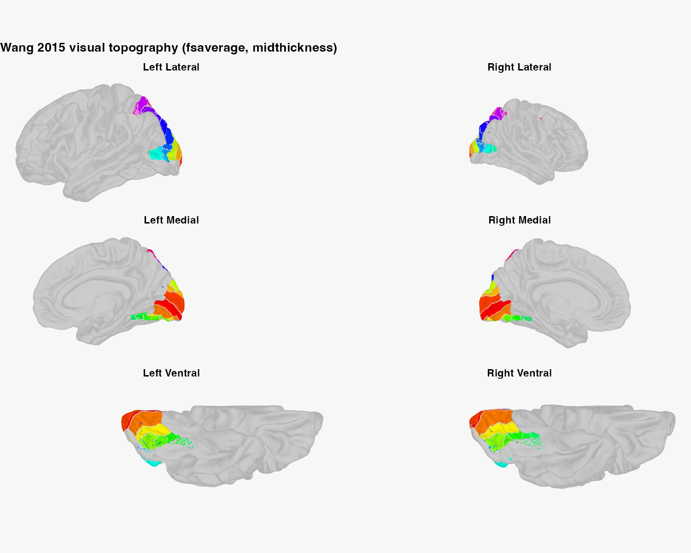
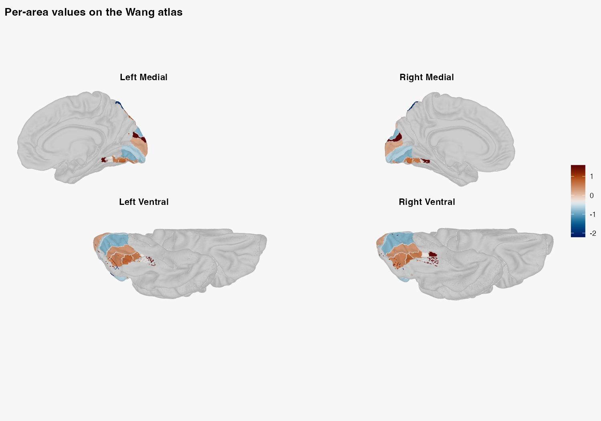
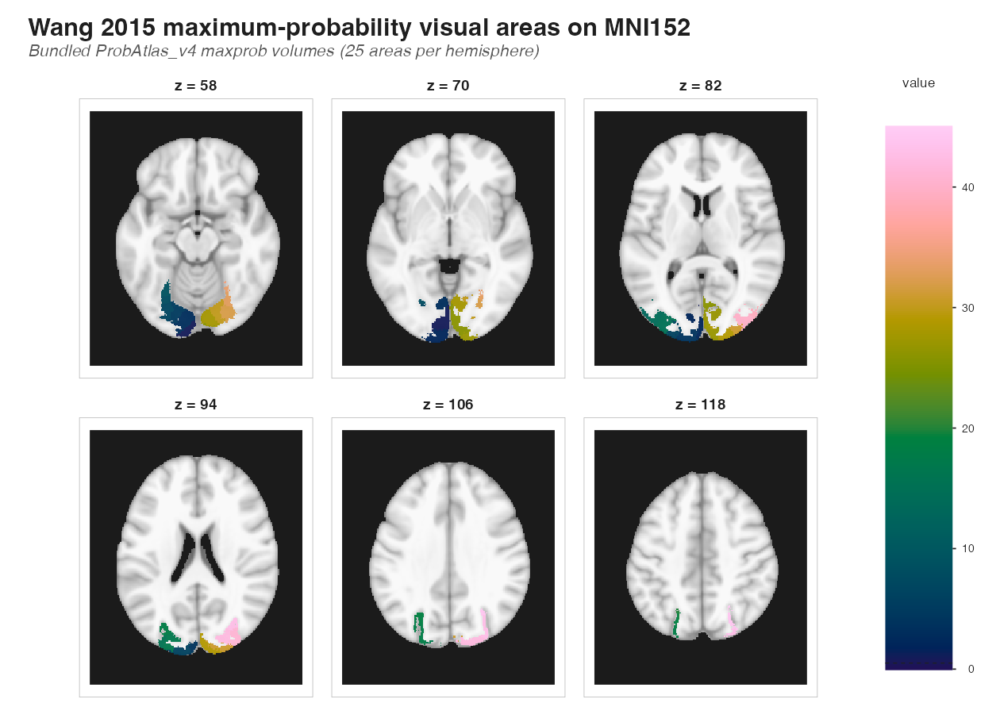
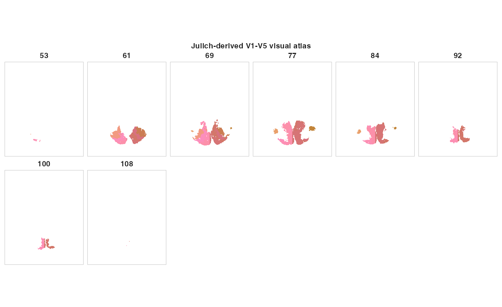
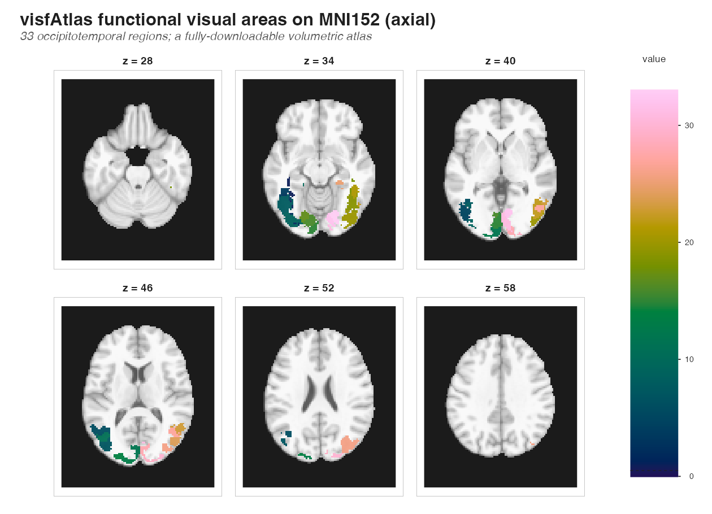
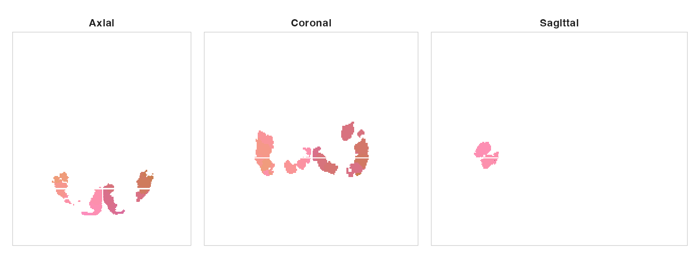
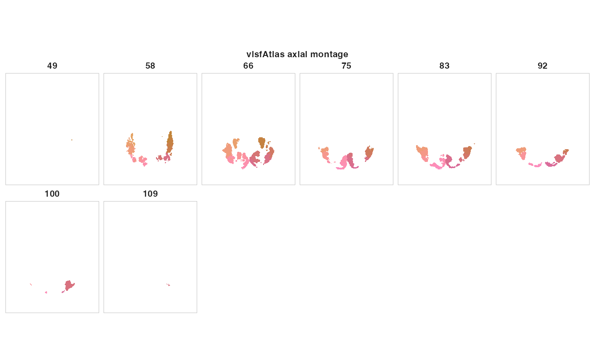

```{r setup, include = FALSE}
if (requireNamespace("ggplot2", quietly = TRUE) &&
    requireNamespace("albersdown", quietly = TRUE)) {
  if (requireNamespace("ggplot2", quietly = TRUE) && requireNamespace("albersdown", quietly = TRUE)) ggplot2::theme_set(albersdown::theme_albers(family = params$family, preset = params$preset))
}

# Loading the Wang atlas (surface geometry, label overlays) requires a
# network connection and a working TemplateFlow / reticulate setup, so the
# heavy chunks are not evaluated during CRAN or offline builds. The code is
# shown verbatim and is exactly what you would run interactively.
can_eval <- requireNamespace("neuroatlas", quietly = TRUE)

templateflow_ok <- FALSE
try({
  templateflow_ok <- reticulate::py_available(initialize = TRUE) &&
    reticulate::py_module_available("templateflow")
}, silent = TRUE)

# Surface rendering needs the geometry (TemplateFlow) plus the plotting stack.
wang_render <- templateflow_ok &&
  requireNamespace("neurosurf", quietly = TRUE) &&
  requireNamespace("ggplot2", quietly = TRUE) &&
  requireNamespace("scico", quietly = TRUE)

knitr::opts_chunk$set(
  collapse = TRUE,
  comment  = "#>",
  message  = FALSE,
  warning  = FALSE,
  echo     = TRUE,
  eval     = FALSE  # opt chunks back in individually
)
```

```{r albers-classes, echo=FALSE, results='asis'}
cat(sprintf(
  paste0(
    '<script>document.addEventListener("DOMContentLoaded",function(){',
    'document.body.classList.remove("palette-red","palette-lapis","palette-ochre","palette-teal","palette-green","palette-violet","preset-homage","preset-study","preset-structural","preset-adobe","preset-midnight");',
    'document.body.classList.add("palette-%s","preset-%s");',
    '});</script>'
  ),
  params$family,
  params$preset
))
```

```{r load, eval = can_eval}
library(neuroatlas)
```

## The Wang visual topography atlas

The Wang et al. (2015) atlas is a probabilistic map of human visual
topography: 25 retinotopically- and functionally-defined areas spanning
early visual cortex (`V1v`, `V1d`, `V2v`, `V2d`, `V3v`, `V3d`, `hV4`), the
ventral stream (`VO1/2`, `PHC1/2`), the dorsal and lateral streams
(`V3A`, `V3B`, `LO1/2`, `TO1/2`), the intraparietal sulcus (`IPS0`–`IPS5`,
`SPL1`), and the frontal eye fields (`FEF`).

The atlas is **surface-native**: it was estimated on the `fsaverage`
cortical surface, and that is the representation `neuroatlas` returns by
default. Visual areas tile the folded cortex along the calcarine sulcus and
the ventral occipitotemporal surface, so a surface rendering is the most
faithful way to look at them. But you will often need the same areas in a
**volume (MNI)** to intersect them with fMRI statistics or other volumetric
data. This vignette shows both: the native surface parcellation rendered
with `plot_brain()`, and the volumetric maximum-probability maps overlaid on
an MNI anatomical background with `neuroim2::plot_overlay()`.

> **Heads up.** Loading the **surface** atlas pulls the label overlays from
> GitHub and the `fsaverage` geometry from TemplateFlow; the **volume** maps
> are downloaded (once, then cached) from the neuroatlas GitHub release. So the
> network-backed chunks are shown but not run during package builds. All figures
> here were generated with exactly the code displayed and committed to the
> package so they render everywhere; run the code yourself (with a network
> connection) to reproduce them.

## Loading the surface atlas

`get_wang_atlas()` returns a `surfatlas` object. Like every surface atlas in
the package it carries one `LabeledNeuroSurface` per hemisphere
(`lh_atlas` / `rh_atlas`) plus the shared bookkeeping fields (`ids`,
`labels`, `hemi`, `name`). TemplateFlow does not distribute an *inflated*
`fsaverage` mesh, so the surface choices are `"midthickness"` (default),
`"pial"`, and `"white"`.

```{r load-atlas, eval = wang_render}
atl <- get_wang_atlas(surf = "midthickness")
atl
```

The 25 areas appear twice in `labels` — once per hemisphere — so the object
describes 50 regions in total:

```{r inspect, eval = wang_render}
length(atl$ids)              # 50: 25 areas x 2 hemispheres
table(atl$hemi)              # how many per hemisphere
head(atl$labels, 8)          # V1v, V1d, V2v, ...

class(atl$lh_atlas)          # "LabeledNeuroSurface"
length(atl$lh_atlas@data)    # one integer label per fsaverage vertex

# Provenance is tracked on every atlas object
atlas_ref(atl)$family        # "wang"
```

## Rendering ROIs on the cortical surface

`plot_brain()` projects the parcellation to 2D and draws one polygon per
area. With no `vals` it colours each area categorically — the natural way to
see the full map. Visual cortex sits on the occipital pole, so the
`medial` and `ventral` views are the informative ones (early visual and the
ventral stream), with `lateral` catching the dorsal/`MT+` cluster.

The Wang atlas labels only a fraction of cortex, so by default the areas
would float on the page. Pass `background = TRUE` to draw the full cortical
silhouette as a grey backdrop, placing the areas in anatomical context.

```{r surface-parcellation-code, eval = FALSE}
plot_brain(
  atl,
  views       = c("lateral", "medial", "ventral"),
  interactive = FALSE,
  style       = "ggseg_like",
  background  = TRUE,   # grey cortex backdrop under the areas
  title       = "Wang 2015 visual topography (fsaverage, midthickness)"
)
```

```{r surface-parcellation-fig, echo = FALSE, eval = TRUE, out.width = "100%", fig.alt = "Wang visual areas on the fsaverage midthickness surface in lateral, medial, and ventral views for both hemispheres. The 25 topographic areas form a coloured cluster at the occipital pole; the rest of cortex is unlabelled. A small separate patch (FEF) appears anteriorly."}

```

### Mapping a value onto the areas

To show a per-area quantity — a decoding accuracy, a contrast estimate, an
eccentricity summary — pass a numeric `vals` vector with one entry per region
(`length(atl$ids)`). Here we fake an early-to-late visual hierarchy gradient
just to demonstrate the colour mapping; in practice these are your data.

```{r surface-values-code, eval = FALSE}
# Synthetic "response amplitude": one value per area, paired across hemispheres
set.seed(1)
area_vals <- rnorm(25)
vals <- area_vals[match(atl$labels, unique(atl$labels))]

plot_brain(
  atl,
  vals           = vals,
  views          = c("medial", "ventral"),
  interactive    = FALSE,
  style          = "ggseg_like",
  background     = TRUE,
  palette        = "vik",
  colorbar       = "bottom",
  colorbar_title = "Response (a.u.)",
  title          = "Per-area values on the Wang atlas"
)
```

```{r surface-values-fig, echo = FALSE, eval = TRUE, out.width = "100%", fig.alt = "A synthetic per-area statistic mapped onto the Wang visual areas with a diverging colour scale; left and right hemispheres are symmetric because values are matched by area label."}

```

### Extracting a single area

`get_roi()` pulls a labelled region off the surface as a
`neurosurf::ROISurface` — its mesh vertices on the appropriate hemisphere.
Because each hemisphere is its own mesh, a label present in both yields one ROI
per hemisphere (`"<label>_left"` / `"<label>_right"`); pass `hemi` to restrict:

```{r get-roi, eval = wang_render}
roi <- get_roi(atl, label = "hV4")      # hV4_left and hV4_right
roi[["hV4_left"]]

# Restrict to one hemisphere, or select by id (left 1-25, right 26-50)
get_roi(atl, label = "V1v", hemi = "left")
get_roi(atl, id = atl$ids[atl$labels == "hV4" & atl$hemi == "right"])
```

## The volumetric counterpart (MNI)

The same 25 areas are also available as **volumes** in MNI space: a
per-hemisphere maximum-probability label volume plus, for each area, a
continuous probability map. These come from the Wang et al. (2015)
ProbAtlas_v4 distribution; `neuroatlas` downloads them (~0.7 MB) from its
GitHub release on first use and caches them, so later calls are offline.
`get_wang_prob_atlas()` (with the default `path_only = TRUE`) returns a
manifest without downloading:

```{r prob-manifest, eval = can_eval}
manifest <- get_wang_prob_atlas(image = "maxprob")
manifest                        # shows the download URL and cache status
head(manifest$files)
```

Set `path_only = FALSE` to fetch (first time) and read the volumes as
`NeuroVol` objects:

```{r prob-load, eval = FALSE}
wp <- get_wang_prob_atlas(image = "maxprob", hemi = "both", path_only = FALSE)
wp$volumes$lh                   # 0 = background, 1..25 = areas
```

> The volume coding labels areas 12/13 as `MST`/`hMT`; these are the same
> regions as `TO2`/`TO1` in the surface naming above (the ids match). To use a
> local copy instead of the download, pass its folder via `prob_dir`.

### Overlaying the areas on an MNI background

With the maximum-probability labels in hand we can paint them on an MNI
anatomical template. We pull a `T1w` background from TemplateFlow, combine the
two hemispheres (offsetting the right so it shares the surface atlas's 1–50
id scheme), resample onto the template grid with nearest-neighbour
interpolation (preserving integer ids), and overlay with
`neuroim2::plot_overlay()`.

```{r prob-overlay-code, eval = FALSE}
# MNI152 anatomical background (1 mm). The ProbAtlas volumes are FSL-MNI; this
# template shares the dimensions but not the exact affine, so we resample below.
bg <- get_template("MNI152NLin6Asym", suffix = "T1w", resolution = "1")

wp <- get_wang_prob_atlas(image = "maxprob", hemi = "both", path_only = FALSE)

# Combine hemispheres: left = ids 1..25, right = ids 26..50
la <- as.array(wp$volumes$lh)
ra <- as.array(wp$volumes$rh); ra[ra > 0] <- ra[ra > 0] + 25L
ov <- neuroim2::NeuroVol(la + ra, neuroim2::space(wp$volumes$lh))
ov <- neuroim2::resample_to(ov, bg, method = "nearest")

neuroim2::plot_overlay(
  bg, ov,
  zlevels   = round(seq(58, 118, length.out = 6)),
  along     = 3L, ncol = 3L,
  ov_cmap   = "batlow",
  ov_thresh = 0.5,      # mask the 0 background; show labelled voxels only
  ov_range  = "data",   # spread the area ids across the colour map
  ov_alpha  = 0.95,
  title     = "Wang 2015 maximum-probability visual areas on MNI152"
)
```

```{r prob-overlay-fig, echo = FALSE, eval = TRUE, out.width = "100%", fig.alt = "Axial montage of the Wang 2015 maximum-probability visual areas overlaid on an MNI152 T1-weighted template; each area is a distinct colour, localised to occipital and parietal cortex."}

```

`plot_overlay()` also takes `ov_alpha_mode` if you want overlay opacity to
track the underlying values — see `?neuroim2::plot_overlay`.

## A fully automatic volumetric alternative

If you want visual-cortex ROIs in MNI **without** a manual download, two
sibling atlases ship as ready-made volume parcellations and fetch
automatically:

- `get_visfatlas()` — Rosenke et al. (2021) functional visual atlas, 33
  regions in MNI (early visual, `hMT+`, and category-selective patches; note
  it has no `hV4`).
- `get_visual_atlas()` — a `V1`–`V5` relabelling of the Julich-Brain visual
  subset.

Both return standard volume `atlas` objects. To put them on an anatomical
background, resample onto an MNI `T1w` template and overlay with
`neuroim2::plot_overlay()` — the same recipe as the Wang maps above.

The Julich-derived early visual atlas can also be rendered directly with the
atlas `plot()` method:

```{r visual-atlas-code, eval = FALSE}
visual <- get_visual_atlas()       # Julich-Brain visual subset, relabelled V1-V5
plot(visual, nslices = 8, title = "Julich-derived V1-V5 visual atlas")
```

```{r visual-atlas-fig, echo = FALSE, eval = TRUE, out.width = "100%", fig.alt = "Axial montage of the Julich-Brain visual subset relabelled as V1 through V5, shown as discrete volume atlas regions in MNI space."}

```

For the larger functional `visfAtlas`, here is the MNI anatomical overlay:

```{r visf-code, eval = FALSE}
bg   <- get_template("MNI152NLin2009cAsym", suffix = "T1w", resolution = "2")
visf <- get_visfatlas()                       # 33 regions, MNI (auto-download)

# Densify the ClusteredNeuroVol to labels, then match the template grid
vol  <- neuroatlas:::.get_atlas_volume(visf)
ov   <- neuroim2::resample_to(vol, bg, method = "nearest")

neuroim2::plot_overlay(
  bg, ov,
  ov_cmap  = "batlow", ov_thresh = 0.5, ov_alpha = 0.95, ov_range = "data",
  along    = 3L, ncol = 3L,
  title    = "visfAtlas functional visual areas on MNI152 (axial)"
)
```

```{r visf-fig, echo = FALSE, eval = TRUE, out.width = "100%", fig.alt = "Axial montage of the visfAtlas functional visual areas overlaid on an MNI152 T1-weighted template, with each region in a distinct colour, localised to occipitotemporal cortex."}

```

For a quick look without an anatomical backdrop, the volume `atlas` objects
also work with the package's own `plot()` (montage or orthogonal view with
automatic discrete ROI colours):

```{r visfatlas-ortho-code, eval = FALSE}
visf <- get_visfatlas()

# Fix the crosshair at the centre of the labelled voxels so all three planes
# pass through visual cortex.
plot(visf, view = "ortho", coord = c(91, 54, 74), unit = "index")
```

```{r visfatlas-ortho-fig, echo = FALSE, eval = TRUE, out.width = "100%", fig.alt = "Three orthogonal planes through the visfAtlas labels in MNI index space, showing axial, coronal, and sagittal views with discrete ROI colours."}

```

```{r visfatlas-montage-code, eval = FALSE}
plot(
  get_visfatlas(),
  nslices = 8,
  title = "visfAtlas axial montage"
)
```

```{r visfatlas-montage-fig, echo = FALSE, eval = TRUE, out.width = "100%", fig.alt = "Axial montage of the visfAtlas labels rendered directly with plot.atlas and discrete ROI colours."}

```

## Choosing the right plotting entry point

Three representations, three functions — worth keeping straight:

| You have | Object | Plot with |
|---|---|---|
| Surface parcellation (`get_wang_atlas()`) | `surfatlas` | `plot_brain()` |
| Volume *atlas* (`get_visfatlas()`, `get_visual_atlas()`) | `atlas` | `plot()` |
| Raw label volume (`get_wang_prob_atlas(path_only = FALSE)`) | `NeuroVol` | `neuroim2::plot_overlay()` |

## References

Wang, L., Mruczek, R. E. B., Arcaro, M. J., & Kastner, S. (2015).
Probabilistic Maps of Visual Topography in Human Cortex. *Cerebral Cortex*,
25(10), 3911–3931. \doi{10.1093/cercor/bhu277}

Rosenke, M., van Hoof, R., van den Hurk, J., Grill-Spector, K., & Goebel, R.
(2021). A Probabilistic Functional Atlas of Human Occipito-Temporal Visual
Cortex. *Cerebral Cortex*, 31(1), 603–619. \doi{10.1093/cercor/bhaa246}
