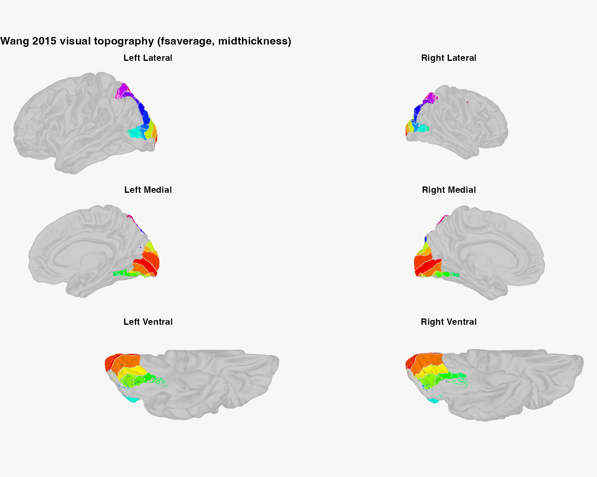
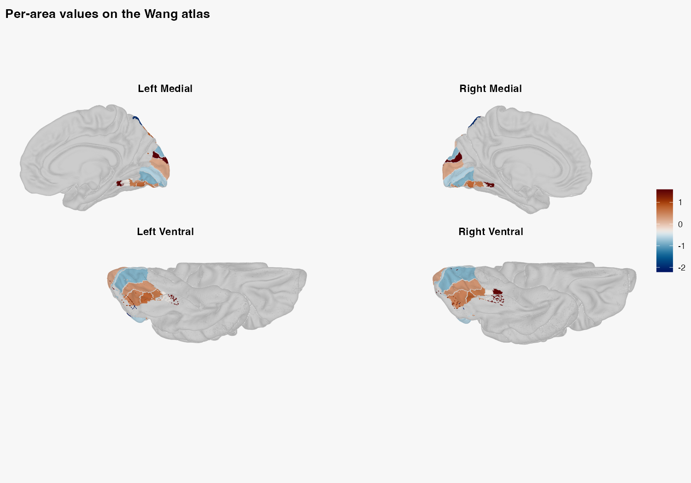
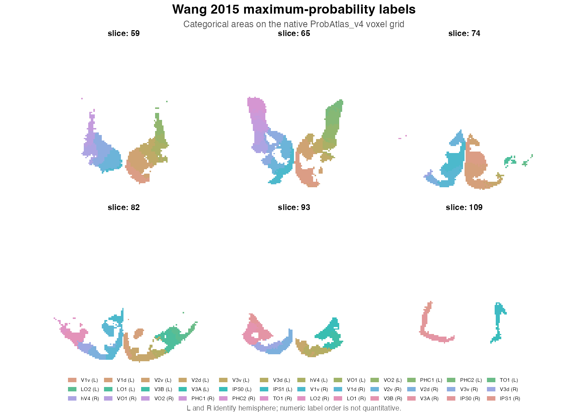

```{r setup, include = FALSE}
if (requireNamespace("ragg", quietly = TRUE)) {
  knitr::opts_chunk$set(dev = "ragg_png")
}
if (requireNamespace("systemfonts", quietly = TRUE) &&
    requireNamespace("albersdown", quietly = TRUE)) {
  albersdown::albers_register_fonts()
}
if (requireNamespace("ggplot2", quietly = TRUE) &&
    requireNamespace("albersdown", quietly = TRUE)) {
  ggplot2::theme_set(
    albersdown::theme_albers(
      family = params$family,
      preset = params$preset
    )
  )
}
knitr::opts_chunk$set(
  collapse = TRUE,
  comment = "#>",
  message = FALSE,
  warning = FALSE
)
```

```{r albers-classes, echo = FALSE, results = "asis"}
cat(sprintf(
  paste0(
    '<script>document.addEventListener("DOMContentLoaded",function(){',
    'document.body.classList.add("palette-%s","preset-%s");',
    '});</script>'
  ),
  params$family,
  params$preset
))
```

The Wang et al. (2015) atlas describes 25 retinotopic and functional visual
areas per hemisphere. `neuroatlas` exposes two related products: a labelled
`fsaverage` surface atlas and the authors' probabilistic volume distribution.
They share a region vocabulary, but they are not interchangeable coordinate
representations.

Network-backed chunks are displayed but not executed during package builds.
The figures are committed outputs generated from the code shown.

## Which product should you use?

| Scientific question | Loader | Representation |
|---|---|---|
| where do areas lie on cortex? | `get_wang_atlas()` | `surfatlas` in `fsaverage` / MNI305 coordinates |
| what is the maximum-probability voxel label? | `get_wang_prob_atlas(image = "maxprob")` | raw `NeuroVol` pair on the native ProbAtlas grid |
| what probability does one area have at each voxel? | `get_wang_prob_atlas(image = "probability")` | raw continuous `NeuroVol` objects |

Choose the representation from the analysis, not from which picture is easier
to make.

## How do you load the native surface atlas?

`get_wang_atlas()` returns 50 regions: the same 25 area names in each
hemisphere. The default midthickness geometry and label overlays may be
downloaded and cached on first use.

```{r load-surface, eval = FALSE}
library(neuroatlas)

wang <- get_wang_atlas(surf = "midthickness")
meta <- roi_metadata(wang)

stopifnot(
  inherits(wang, "surfatlas"),
  length(wang$ids) == 50L,
  all(table(wang$hemi) == c(left = 25L, right = 25L)),
  atlas_ref(wang)$template_space == "fsaverage",
  atlas_ref(wang)$coord_space == "MNI305"
)
```

The medial and ventral views reveal early and ventral visual cortex; lateral
views show dorsal and lateral areas. `background = TRUE` keeps the unlabelled
cortex visible as anatomical context.

```{r surface-parcellation-code, eval = FALSE}
plot_brain(
  wang,
  views = c("lateral", "medial", "ventral"),
  interactive = FALSE,
  style = "ggseg_like",
  background = TRUE,
  title = "Wang 2015 visual topography (fsaverage, midthickness)"
)
```

```{r surface-parcellation, echo = FALSE, out.width = "100%", fig.alt = "Wang visual areas shown on lateral, medial, and ventral views of both fsaverage hemispheres. Coloured visual areas occupy occipital, ventral, and parietal cortex on a light grey anatomical surface."}

```

## How do you map area-level values?

Supply one value for every region ID. To pair homologous labels across
hemispheres, map by label explicitly rather than assuming the two halves share
an accidental row order:

```{r surface-values-code, eval = FALSE}
set.seed(1)
area_values <- stats::setNames(
  stats::rnorm(length(unique(wang$labels))),
  unique(wang$labels)
)
values <- unname(area_values[wang$labels])

stopifnot(
  length(values) == length(wang$ids),
  identical(
    values[wang$hemi == "left"],
    values[wang$hemi == "right"]
  )
)

plot_brain(
  wang,
  vals = values,
  views = c("medial", "ventral"),
  interactive = FALSE,
  style = "ggseg_like",
  background = TRUE,
  palette = "vik",
  colorbar = "right",
  colorbar_title = "Response (a.u.)",
  title = "Per-area values on the Wang atlas"
)
```

```{r surface-values, echo = FALSE, out.width = "100%", fig.alt = "Synthetic area-level values mapped symmetrically onto medial and ventral views of the left and right Wang visual atlas, with a blue-to-orange response colorbar."}

```

`get_roi(wang, label = "hV4")` returns one `ROISurface` per hemisphere. Use
`hemi = "left"` or `hemi = "right"` when the analysis is unilateral.

## How do you inspect the volume product safely?

A manifest is side-effect-free. It states the source, requested files, and
whether those files are already cached:

```{r volume-manifest}
library(neuroatlas)

manifest <- get_wang_prob_atlas(
  image = "maxprob",
  hemi = "both",
  path_only = TRUE
)

manifest$files[c("hemi", "member", "exists")]
```

Set `path_only = FALSE` to download and read the volumes. The left and right
label maps must share a grid and must not overlap before they are combined:

```{r volume-load, eval = FALSE}
wp <- get_wang_prob_atlas(
  image = "maxprob",
  hemi = "both",
  path_only = FALSE
)

left <- as.array(wp$volumes$lh)
right <- as.array(wp$volumes$rh)

stopifnot(
  identical(dim(left), dim(right)),
  identical(
    neuroim2::space(wp$volumes$lh),
    neuroim2::space(wp$volumes$rh)
  ),
  !any(left > 0 & right > 0),
  all(unique(left[left > 0]) %in% wp$labels$id),
  all(unique(right[right > 0]) %in% wp$labels$id)
)

right[right > 0] <- right[right > 0] + 25L
labels <- neuroim2::NeuroVol(
  left + right,
  neuroim2::space(wp$volumes$lh)
)
```

Render the label map categorically on its **native grid** unless you have a
validated anatomical reference in that same space. The zero background is
omitted, and only areas present in the selected slices receive colours:

```{r volume-figure-code, eval = FALSE}
label_array <- as.array(labels)
occupied <- which(label_array > 0, arr.ind = TRUE)
slice_ids <- unique(as.integer(stats::quantile(
  occupied[, 3],
  probs = seq(0.08, 0.92, length.out = 6),
  type = 1
)))

x_limits <- pmax(
  1L,
  pmin(dim(label_array)[1], range(occupied[, 1]) + c(-7L, 7L))
)
y_limits <- pmax(
  1L,
  pmin(dim(label_array)[2], range(occupied[, 2]) + c(-7L, 7L))
)

slice_data <- do.call(rbind, lapply(slice_ids, function(z) {
  index <- which(label_array[, , z] > 0, arr.ind = TRUE)
  data.frame(
    x = index[, 1],
    y = index[, 2],
    region_id = label_array[cbind(index[, 1], index[, 2], z)],
    slice = factor(z, levels = slice_ids)
  )
}))

region_names <- c(
  stats::setNames(paste0(wp$labels$label, " (L)"), wp$labels$id),
  stats::setNames(paste0(wp$labels$label, " (R)"), wp$labels$id + 25L)
)
present_ids <- sort(unique(slice_data$region_id))
region_palette <- stats::setNames(
  grDevices::hcl.colors(length(present_ids), "Dynamic"),
  present_ids
)

wang_figure <- ggplot2::ggplot(
  slice_data,
  ggplot2::aes(x, y, fill = factor(region_id))
) +
  ggplot2::geom_tile(width = 1, height = 1) +
  ggplot2::facet_wrap(~slice, ncol = 3, labeller = ggplot2::label_both) +
  ggplot2::coord_fixed(xlim = x_limits, ylim = y_limits, expand = FALSE) +
  ggplot2::scale_fill_manual(
    values = region_palette,
    labels = region_names[as.character(present_ids)],
    name = NULL,
    drop = FALSE
  ) +
  ggplot2::labs(
    title = "Wang 2015 maximum-probability labels",
    subtitle = "Categorical areas on the native ProbAtlas_v4 voxel grid",
    caption = paste(
      "L and R identify hemisphere; numeric label order is not quantitative."
    )
  ) +
  ggplot2::theme_void(base_size = 11) +
  ggplot2::theme(
    legend.position = "bottom",
    legend.text = ggplot2::element_text(size = 6.5),
    legend.key.size = grid::unit(0.28, "lines"),
    legend.key.width = grid::unit(0.75, "lines"),
    legend.box = "horizontal",
    plot.title = ggplot2::element_text(
      face = "bold", hjust = 0.5, size = 16
    ),
    plot.subtitle = ggplot2::element_text(hjust = 0.5, colour = "grey30"),
    plot.caption = ggplot2::element_text(hjust = 0.5, colour = "grey35"),
    strip.text = ggplot2::element_text(face = "bold", size = 10),
    panel.background = ggplot2::element_rect(
      fill = "white", colour = "grey85"
    ),
    plot.background = ggplot2::element_rect(fill = "white", colour = NA)
  ) +
  ggplot2::guides(
    fill = ggplot2::guide_legend(nrow = 3, byrow = TRUE)
  )

wang_figure
```

```{r volume-figure, echo = FALSE, out.width = "100%", fig.alt = "Six tightly cropped axial slices through the Wang maximum-probability maps on their native grid. Visual areas present in each slice have categorical colours and left or right hemisphere labels; zero background is white."}

```

This figure deliberately has no unrelated T1 background. Nearest-neighbour
resampling preserves integer labels on a new grid; it does not prove that an
FSL-MNI product and a different MNI template are anatomically registered.

## What about the other visual-cortex atlases?

`get_visfatlas()` loads the 33-region Rosenke et al. functional visual atlas on
its distributed 1 mm single-subject MNI grid. Its provenance records alignment
to MNI colin27. `get_visual_atlas()` derives V1-V5 regions from Julich-Brain.
Both return ordinary volume `atlas` objects and can be rendered directly:

```{r visual-atlas-code, eval = FALSE}
visf <- get_visfatlas()
plot(visf, nslices = 8, title = "visfAtlas on its distributed voxel grid")

julich_visual <- get_visual_atlas()
plot(julich_visual, nslices = 8, title = "Julich-derived V1-V5")
```

Do not resample `visfAtlas` onto `MNI152NLin2009cAsym` and call the result
aligned: regridding is not a validated colin27-to-MNI2009 nonlinear transform.
Inspect `atlas_ref()` and the transform plan before any cross-template overlay.

## A representation checklist

Before analysis, record:

1. atlas product and citation;
2. surface or volume representation;
3. declared template and coordinate space;
4. region-ID convention, including hemisphere offsets;
5. any transform applied, with interpolation method and provenance.

That record is what makes the surface and volume versions scientifically
traceable rather than merely visually similar.

## References

Wang, L., Mruczek, R. E. B., Arcaro, M. J., & Kastner, S. (2015).
Probabilistic Maps of Visual Topography in Human Cortex. *Cerebral Cortex*,
25(10), 3911-3931. \doi{10.1093/cercor/bhu277}

Rosenke, M., van Hoof, R., van den Hurk, J., Grill-Spector, K., & Goebel, R.
(2021). A Probabilistic Functional Atlas of Human Occipito-Temporal Visual
Cortex. *Cerebral Cortex*, 31(1), 603-619. \doi{10.1093/cercor/bhaa246}
